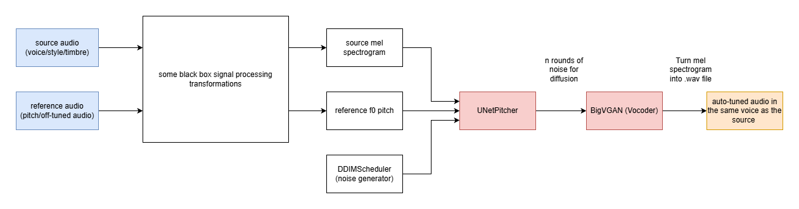
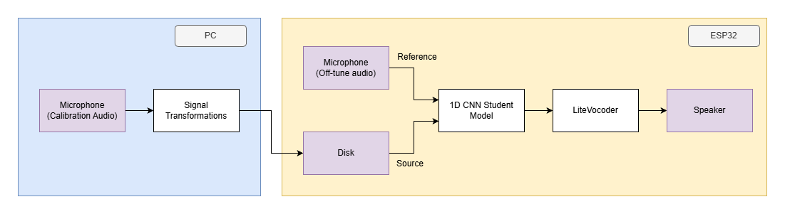

# TODO
- Consider switching to Raspberry Pi
    - Use Emma's :D
    - Pico 2: $8.95
    - Zero V1.3: $14.45
    - Zero 2 W: $21:75
    - Model A+: $36.45
- How heavy and what the LiteVocoder can do
- Try out using the big model with my own audio to test feasibility in the best case

# Usage
- clone repo
- `uv init` 
- `uv pip install -r requirements.txt`
- `uv run template_based_apc.py`


# What does DiffPitcher do



### Inputs
- Source Audio (singer's voice/timbre/off-key singing)
    - model extracts "speaker identity/timbre" to make output sound the same as the original singer
- Reference Audio (off key singing)
    - template mode: 
        - directly use off-tune audio pitch
    - score mode:
        - instead of audio, use the MIDI as the pitch
        - use PitchFormer model to predict the reference f0 pitch (pitch contour)

### Outputs
- Autotuned mel-spectrogram of the reference in the same timbre as the source singer 
    - feed this into BigVGAN to get the actual output audio

### Advantages over regular autotune
- Source-Filter Disentanglement: 
    - treats source singer's voice like an instrument
    - adjusts the pitch (cords,notes) but keeps the filter (vocal timbre)
- Generative reconstruction:
    - Doesn't just shift frequencies, it regenerates the notes 
    - preserves natural glottal pulses
        - better at vibrato and digital shifting

### Models
- UNetPitcher
- BigVGAN
- PitchFormer

# Idea
Instead of using the off-key singing as the source for the vocal filter, we pitch snap it to the closest note and use it as the reference.
A separate 5-10s "calibration" audio will be pre-recorded as the vocal filter and pre-loaded onto the ESP32's disk.



### On PC
1. train a dumb 1D CNN student model on Diff Pitcher
2. on the pc, record a 5-10s calibration audio to get person's timbre 
3. produce vector embeddings

### On ESP32
1. Store calibration embeddings on disk
2. record input off-tune audio
3. run 1D CNN to get output mel-spectrogram
4. run small vocoder to get the output audio 
5. play the auto-tuned audio

### Details
- Use int8 
- tensorflow Lite micro?
- Use template_pitcher
    - don't use MIDI in order to remove the PitchFormer model
    - score_pitcher needs timestamps to be aligned with MIDI 
- Data transformations
    - source audio 
        - get its mel spectrogram (same process as described in wikipedia)
    - reference audio 
        - mix with input and perform signal processing functions to get f0 pitch 

# Training

### Datasets
Take good audio (pure voice) and add noise
-  -> currently support this
- 

# How to run training loop
Download the OpenSigner dataset from this . Make a directory called `/data` at project root and put it in there. Then unzip the file with 
```
tar -xvzf OpenSinger.tar.gz --exclude="*.txt" --exclude="*.lab"
```
The unzipped files should be around 50 GB (according to Gemini at least, I didn't try). Then run
```
cd pitch_controller
uv run prepare_test_data.py
```

Then folder structure should look like this
```
data/
  ├── meta_fix.csv
  ├── OpenSinger (containing subdirectories with lots of .wav files)
  └── training/
      ├── mel/
      │   ├── <audio clip 1>.npy
      │   ├── <audio clip 2>.npy
      |   └── ...
      ├── f0/
      │   ├── <audio clip 1>.npy
      │   ├── <audio clip 2>.npy
      |   └── ...
      └── world/
          ├── <audio clip 1>.npy
          ├── <audio clip 2>.npy
          └── ...
```

now run
```
uv run  train_consistency.py 
```

Tunable parameters aree configured in `train_consistency.py` near the top. Feel free to change the batch size, mines is at 1 or else I get gpu OOM. Also, currently both students are on the GPU and the teacher is on CPU. If all models fit on GPU then feel free to move the Teacher over as well. Losses as well as inference outputs are written to `/pitch_controller/logs_consistency`. Consistency model weights are written to `ckpt_consistency`.

## TODO:
- make loss graph
- make ability to continue training from a model weight snapshot
- qol changes to make it easier to switch between running on gpu and cpu

# Possible Student Models
- 1D CNN
- Others
    - LSTM (complex)
    - Phase Vocoding
    - PSOLA
    - DSP
    - Consistency Models
    - Flow Matching

# Possible student vocoders
- DDSP
- LCPNet
- LiteVocoder
